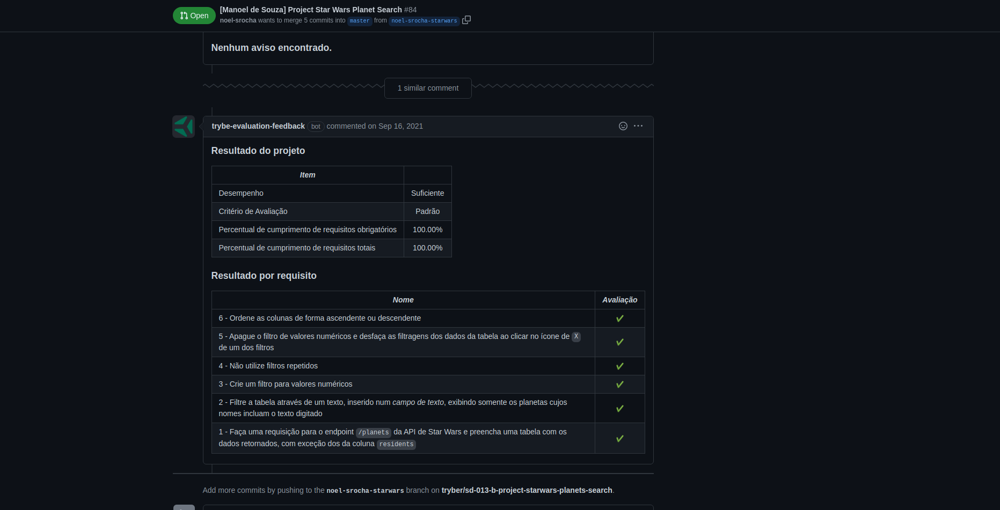

# Project Star Wars Search

### The Assignment

You will develop a filter list of planets from the Star Wars universe using **Context API and Hooks** to control global states.

### The Experience

This was one of the assignments built by [Trybe](www.betrybe.com) that made me feel at home, because I love anything related to Star Wars and space movies. So I worked extra hard to be satisfied with what I built at the time.

### Skills to be Tested

In this project, I was able to:

* Use the **React** _Context API_ to manage state.
* Use the _React Hook useState_;
* Use the _React Hook useContext_;
* Using the _React Hook useEffect_;
* Create custom _React Hooks_.

### Evaluator Results

